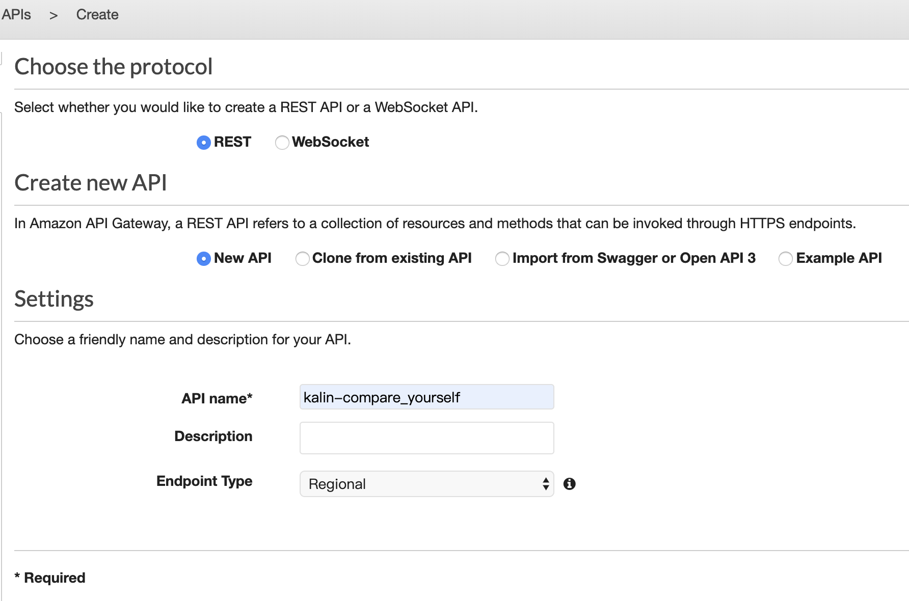
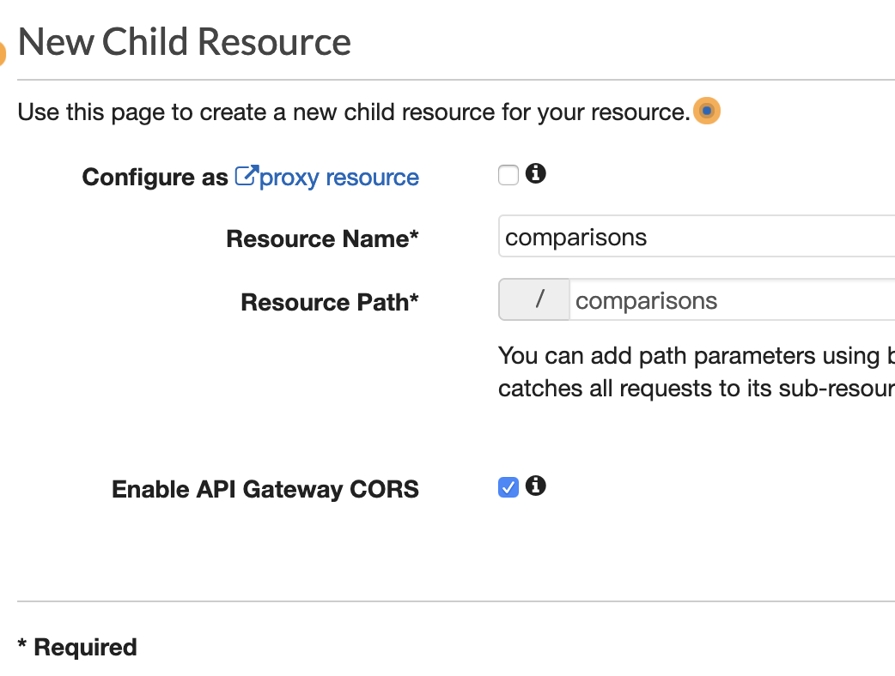
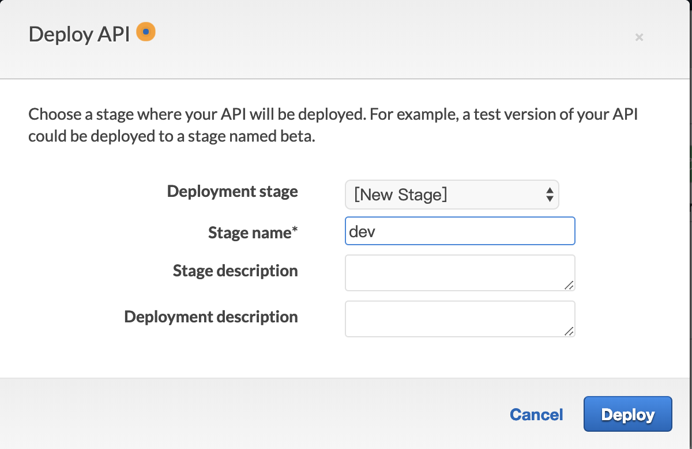

# Hello API Gateway

Create a Mock API

## 1. Create API

- API name: kalin-compare_yourself
- 

## 2. Create Resource

- Resource Name: comparisons
- 

## 3. Create Method

- Method: GET

## 4. Integration Request

- Integration type: Mock
- 

## 5. Integration Response

- Mapping Templates > Content-Type > application/json:
- 

```
{"message":"hello"}
```

## 6. Deploy API

- New Stage name: dev
- 
- Copy invoke URL
- 

### 7. Verify on browser

- 
