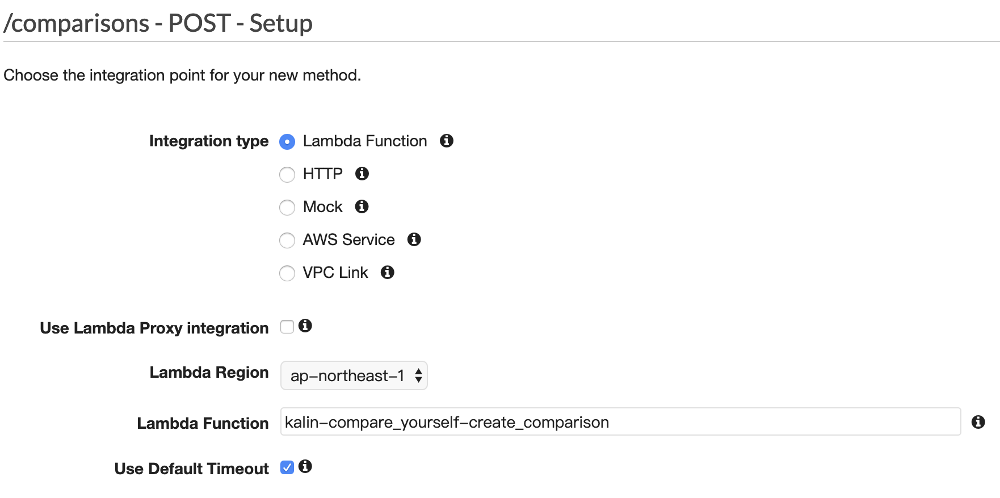
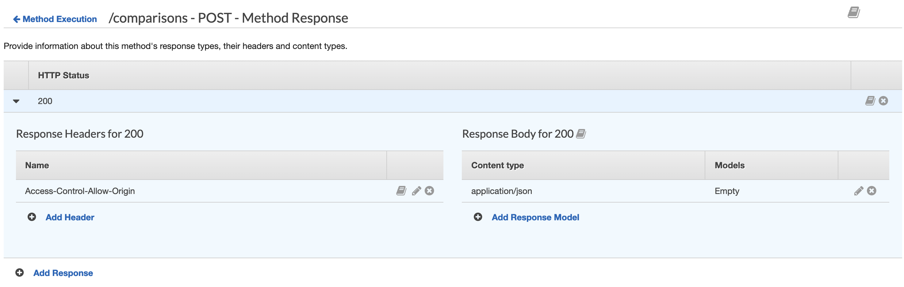
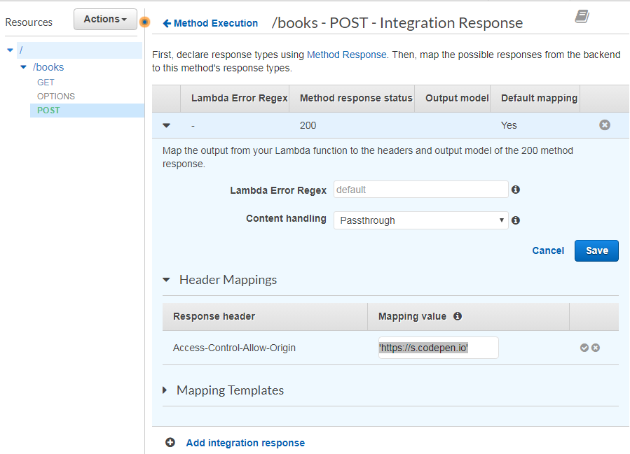

# Use Lambda as the Integration Request Type

## 1. [Lambda service] Create a Lambda function

- Function name: kalin-compare_yourself-create_comparison
- Runtime: Node.js 8.10
- [Lambda code](lambda/kalin-compare_yourself-create_comparison/index.js)

## 2. [API Gateway service] Create POST method and use this Lambda Function

- Integration type: Lambda Function
- Lambda Function: kalin-compare_yourself-create_comparison
- 

## 3. Allow CORS

### What is CORS?

- JS in https://www.abc.com web page invokes https://www.def.com API
- https://developer.mozilla.org/zh-TW/docs/Web/HTTP/CORS

### 3-1. Add 'Access-Control-Allow-Origin' header in "Method Response"

- 

### 3-2. Set Mapping Value of 'Access-Control-Allow-Origin' in "Integration Response"

- 

## 4. Verify the POST API

- [client code](client/index.js)

```
// Request header:
Content-Type: application/json

// Request body:
{"name":"Mary", "age":16}

// Response body:
{
    "statusCode": 200,
    "payload": {
        "name": "Mary",
        "age": 16
    }
}
```
